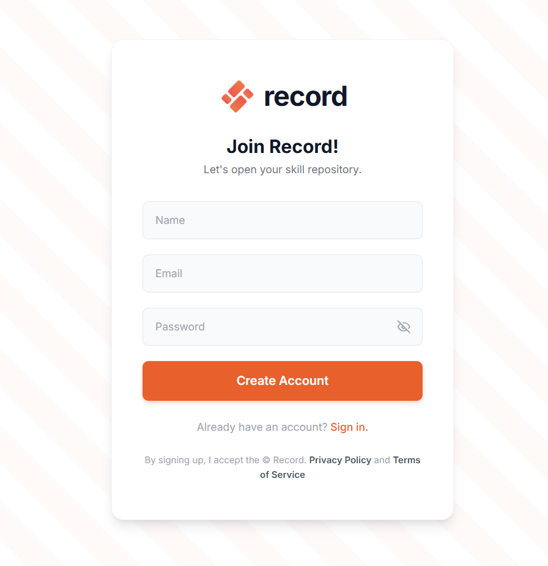
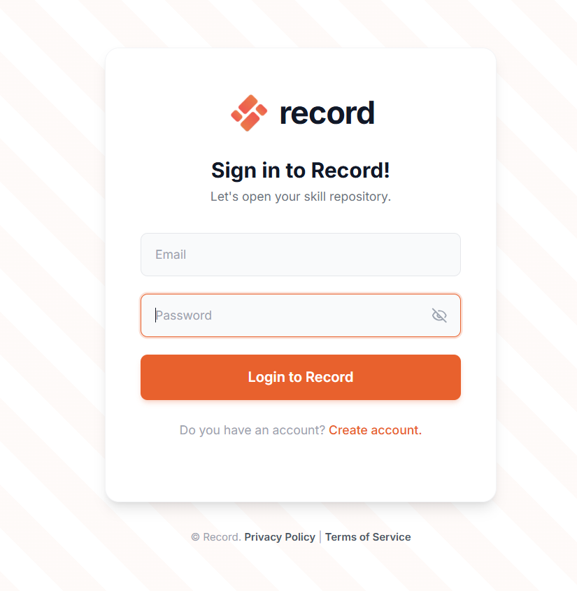
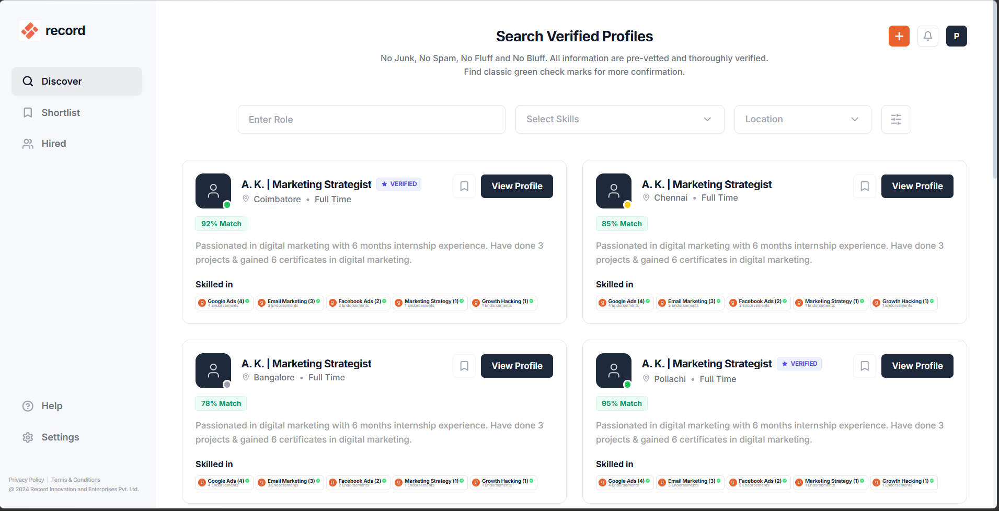

# Record - Skill Repository Platform

A full-stack MERN application for searching and managing verified professional profiles.

## Tech Stack

- **Frontend:** React.js, Tailwind CSS, React Router, Axios, React Hot Toast
- **Backend:** Node.js, Express.js
- **Database:** MongoDB (Mongoose ODM)
- **Authentication:** JWT + bcrypt

## Project Structure

```
RECORD/
├── backend/
│   ├── config/
│   │   └── db.js                 # MongoDB connection
│   ├── controllers/
│   │   └── authController.js     # Signup, Login, GetMe logic
│   ├── middleware/
│   │   └── authMiddleware.js     # JWT verification middleware
│   ├── models/
│   │   └── User.js               # User schema
│   ├── routes/
│   │   └── authRoutes.js         # Auth API routes
│   ├── server.js                 # Express server entry point
│   ├── package.json
│   └── .env                      # Environment variables
│
├── frontend/
│   ├── public/
│   │   └── record-logo.svg       # Favicon
│   ├── src/
│   │   ├── components/
│   │   │   ├── ProtectedRoute.jsx  # Auth guard component
│   │   │   └── RecordLogo.jsx      # Logo component
│   │   ├── pages/
│   │   │   ├── Login.jsx         # Login page
│   │   │   ├── Signup.jsx        # Signup page
│   │   │   └── Dashboard.jsx     # Static dashboard
│   │   ├── utils/
│   │   │   └── api.js            # Axios instance + API calls
│   │   ├── App.jsx               # Router setup
│   │   ├── main.jsx              # React entry point
│   │   └── index.css             # Global styles + Tailwind
│   ├── index.html
│   ├── vite.config.js
│   ├── tailwind.config.js
│   ├── postcss.config.js
│   └── package.json
│
└── README.md
```

## Setup & Installation

### Prerequisites

- Node.js (v18+)
- MongoDB Atlas account (or local MongoDB)
- npm or yarn

### 1. Clone / Navigate to the project

```bash
cd RECORD
```

### 2. Backend Setup

```bash
cd backend
npm install
```

### 3. Configure Environment Variables

Edit `backend/.env`:

```env
PORT=5000
MONGO_URI=mongodb+srv://<username>:<password>@cluster0.xxxxx.mongodb.net/recordDB?retryWrites=true&w=majority
JWT_SECRET=your_super_secret_key_here
```

### 4. Frontend Setup

```bash
cd frontend
npm install
```

### 5. Run the Application

**Terminal 1 - Backend:**
```bash
cd backend
npm run dev
```

**Terminal 2 - Frontend:**
```bash
cd frontend
npm run dev
```

The app will be available at: **http://localhost:5173**

## API Endpoints

| Method | Endpoint         | Description         | Access  |
|--------|-----------------|---------------------|---------|
| POST   | /api/auth/signup | Register new user   | Public  |
| POST   | /api/auth/login  | Login user          | Public  |
| GET    | /api/auth/me     | Get current user    | Private |

## Features & Recent Updates

### Architecture & Security
- ✅ Email + Password authentication loop
- ✅ bcrypt password hashing & JWT token-based session management
- ✅ Protected routes (Dashboard requires login)
- ✅ MongoDB Atlas cloud connection using Mongoose ODM

### Frontend Interface & UX Polish
- ✅ High-contrast "Quantum" dark theme with a standardized typographic scale
- ✅ Pixel-perfect Dashboard UI engine syncing search filters with a dynamic profile card grid
- ✅ Compact, non-overflowing skill badges and responsive navigation sidebar
- ✅ Interactive visual status indicators (Availability statuses, Verified Badges, Match Percentage)
- ✅ Seamless skeleton loading states mitigating layout shifts during data retrieval
- ✅ React Hot Toast notifications for all system events

### Admin & Data Features
- ✅ Real-time NotificationService tracking dynamic changes (e.g., inventory status) directly in the header
- ✅ Optimized chart visualizations with high-contrast text and exact data count points

### Testing & Reliability
- ✅ **Frontend:** Automated UI testing suite using Vitest + React Testing Library bridging components & auth flows
- ✅ **Backend:** Robust endpoint & middleware testing framework using Jest + Supertest

## Pages

1. **Login** (`/login`) - Sign in with email and password
2. **Signup** (`/signup`) - Create account with name, email, password
3. **Dashboard** (`/dashboard`) - Profile search dashboard with interactive components (protected path)

## OUTPUT :






## License

© 2024 Record Innovation and Enterprises Pvt. Ltd.
